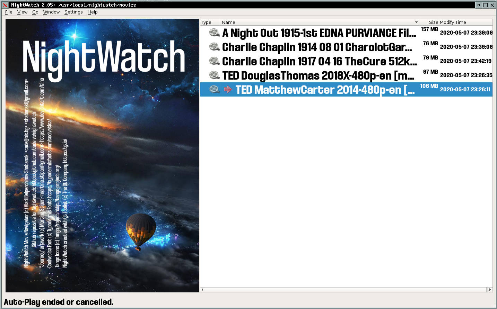

#  NIGHTWATCH VIDEO NAVIGATOR
## 2020 (c) Vladi Belperchinov-Shabanski "Cade"

#  INTRODUCTION

NightWatch (NW) is directory browser for video media files. It has 
full keyboard access and can use single separated keypad 
(also wireless keypads) for navigation.

NW has all functions available in the main menu. However with single keypad
the regular main menu is not accessible. Because of this there is the
"keypad menu" accessible with INSERT key.

NW has Auto-Play function, which goes to the next video file and play it for the 
next 3 video files in the list with pause of 4 seconds between.
Pressing any key during the pause will cancel Auto-Play. 
Also it will be cancelled if end-of video files list reached.
   
NW shows Last-Played marker (red arrow) for the last video file played in a 
directory if more than one video file found. When entering new directory, the 
last played video file will be selected as current position in the list.
   
When changing directory to the parent directory, the current position will be 
set to the name of the last directory.

Keypad menu "Reload current directory" will re-read current directory without 
any caching.   

NW will reload current directory if there are changes. Current position will 
be preserved.

If there is running video player, it will be stopped before new one is started.
This prevents multiple players running when your cat steps on the keyboard :)
If there is already running player, pressing ESC key in the NW main window 
will stop the player.

For videos, files with the following extensions are 
accepted: AVI, MKV, MPG, MPEG, MP4, TS.

Nightwatch is written entirely in C++ with Qt Toolkit.

Screenshots can be found in  directory.

#  POSTERS

Each video file and directory with video files can have an image to represent
them, i.e. "posters". Images are searched for with these rules:

For a video file, NW looks for the same name image, for example:

   testing.mp4
   testing.jpg
   
If no image with the same name found, poster will be assumed to be the first
found image in current directory, unless there are other video files with
matching poster images. Why is this? If there is several videos in a directory
and there is a image, which does not match any video, it probably is a image
representing all videos in the directory. However if there is at least one
image matching a video file, the rule for first image in the directory does
not apply anymore.

For directory, first found image inside directory will be assumed to be poster.

For posters, files with the following extensions are accepted: JPG, JPEG, PNG.

#  HOW TO COMPILE

To compile NW you need Qt toolkit.
   
For Devuan/Debian you need the following packages:
   
   qt5-default (meta package)
   qtbase5-dev
   qt4-qmake
   
Those will pull further dependencies.
   
After installing needed packages, do the following:
   
   qmake nightwatch.pro
   make
   
And you should get "nightwatch" binary.

#  HOW TO USE

NightWatch is just navigatior. It does not have vide player inside. You have
to use separate one. I recommend to use MPlayer but you may use whatever
player you like.

To start vide playing, NightWatch will try to execute:

    nightwatch-video-player
    
You need either to create shell script with this name, which will execute the
wanted vide player or to sym-link the player with this name. 

Sym-link:

    ln -s /usr/bin/mplayer  /usr/local/bin/nightwatch-video-player
    
Shell script content should be something like:

    #!/bin/bash
    mplayer "$*"
    # end of file

If you have a problem with the setup, contact me (see contact details below).

#  CONFIGURATION FILES

Configuration file is created with default values but can be
edited manually if needed:

    $HOME/.config/CSA/NW2.conf

There are few state files, which are not supposed to be edited:

    # last locations with played videos
    $HOME/.config/CSA/NW2_LL.conf

    # last played videos for each visited location
    $HOME/.config/CSA/NW2_LL.conf

#  CREDITS

    NightWatch Video Navigator 
    (c) Vladi Belperchinov-Shabanski <cade@bis.bg> <shabanski@gmail.com>
    Github repo/site for Nightwatch: https://github.com/cade-vs/nightwatch

    "Journey" artwork 
    (c) Martina Stipan <martina.stipan@gmail.com> 
    https://www.deviantart.com/t1na

    Coolvetica Font 
    (c) Typodermic Fonts 
    https://typodermicfonts.com/coolvetica/

    Tango Icons 
    (c) Tango Project 
    http://tango-project.org/

    NightWatch created with Qt Toolkit (c) The Qt Company 
    https://qt.io/

#  LICENSE

Nightwatch is licensed under GPLv2, for full text see file "COPYING".

#  CONTACT

Questions and ideas, please, send to:

    Vladi Belperchinov-Shabanski "Cade"
    <cade@bis.bg> <shabanski@gmail.com> <cade@cpan.org>
    https://github.com/cade-vs
    github repo: git@github.com:cade-vs/nightwatch.git
